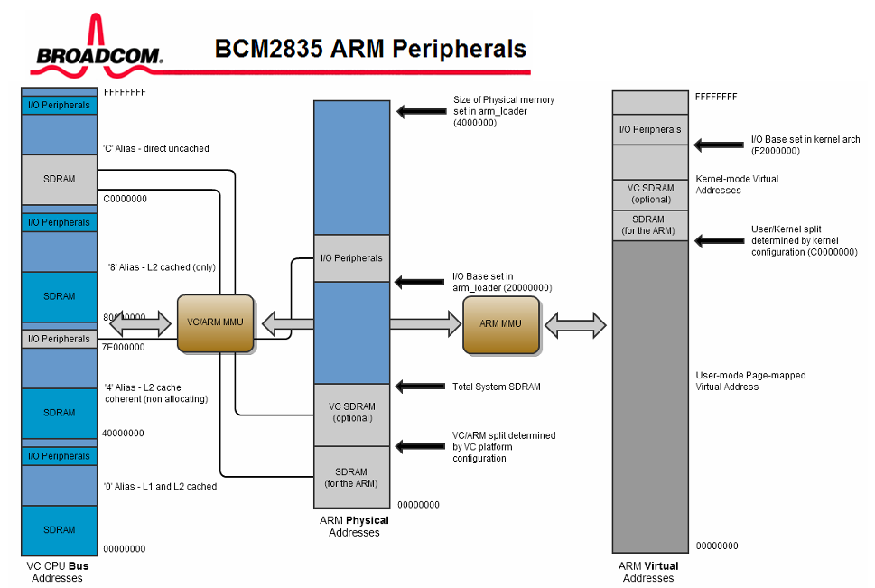
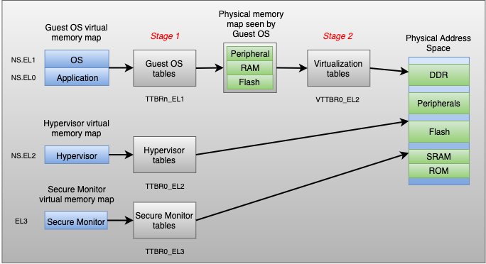

# Hypervisor implementation for Raspberry Pi 3B

## Link
- [https://github.com/matsud224/raspvisor](https://github.com/matsud224/raspvisor)

## Memo
- RPi3 の DRAM(+デバイス) は、物理アドレスの 0 から 1GB にマップされている
    - 0x0000_0000_0000_0000 から 0x0000_0000_3fff_ffff
- RPi OS のカーネルのアドレス空間では、上記の 1GB のページ全体がリニアにマップされている
    - 0xffff_0000_0000_0000 から 0xffff_0000_3fff_ffff
- aarch64 では
    - アドレスの上位12ビットが 0 の場合は TTBR0_el1 で指定した変換テーブルで仮想アドレスを変換する(ユーザプロセス用)
    - アドレスの上位12ビットが 1 の場合は TTBR1_el1 で指定した変換テーブルで仮想アドレスを変換する(カーネル用)
    - 二段階アドレス変換を行う場合、 VTTBR_EL2 で指定した変換テーブルで中間物理アドレスを変換する
- mrs: copy register from status register
    - mrs x0, esr_el2
- msr: copy status register from register
    - msr esr_el2, x0

- ゲスト OS (kernel8.elf)は 0xffff_... に配置されるようにコンパイルされているが、objcopy で 0x0000_... に配置するように変換されている
- その結果、ゲスト OS がロードされる位置が本来 EL0 アプリ用の位置になっており、かつ TTBR0_EL1 が設定されていないのでクラッシュしていた
- elf ファイルをロードすれば正しく配置できると考えられる

- aarch64 で扱える論理アドレスは48ビットまで
    - EL1 では 0xffff... で始まるアドレスを TTBR1_EL1 で指定した変換テーブルで変換できる
    - EL2 にはそのような仕組みはないので扱うことができない(上位16ビットは単に無視される)
- EL1 の IPA は VTTBR_EL2 で PA に変換される(EL2 の VA に変換されるわけではない)
- EL2 の VA は TTBR0_EL2 で PA に変換される

- synchronous 例外が発生した場合、PC が 0x200 にジャンプする

- qemu を `-kernel` オプション付きで実行すると EL2 で起動される

## Debug
- flat binary にデバッグ情報を残すこともできるようだが、objcopy がうまくデバッグ情報を認識してくれない
- 以下のように gdb で kernel8.elf を追加で読み込むほうが楽
    - `(gdb) add-symbol-file build/kernel8.elf`
- 状況に応じて `layout asm` もしくは `layout src` で表示を切り替える
- デバッグ時は毎回 target remote するのは大変なので以下のようにコマンドラインで指定するといい
    - `$ gdb-multiarch -ex 'target remote :1234'`
- gdb で VTTBR_EL2 を調べる
    - `info registers VTTBR_EL2`
- Hypervisor 環境と gdb を組み合わせる場合、ブレークポイントは仮想アドレスに対して設定する
    - CPU は MMU を介して常に仮想アドレス上で実行されている
    - 複数のゲスト OS は同じ仮想アドレスを使うので、どのゲスト OS がブレークされたかわからない
        - `info registers VTTBR_EL2` で VMID を見れば、どのゲストがブレークされたか確認できる
- gdb で現在の EL を見るには CPSR レジスタを読む
    - `i r cpsr`
    - CPSR[3:2] が Exception Level なので、たとえば 0x3c5 の場合は3~0 ビットが 0b0101 なので EL1 であることがわかる
- MMU が有効かどうか確認するには SCTLR を読む
    - `i r SCTLR`
    - 0 ビット目が 1 なら MMU は有効

## BCM2873
- BCM2873 のメモリマップは以下のマニュアルに書かれている
    - BCM2837-ARM-Peripherals.-.Revised.-.V2-1.pdf
    - 1.2.3 ARM physical addresses
        - Physical addresses range from 0x3F000000 to 0x3FFFFFFF for peripherals.
          The bus addresses for peripherals are set up to map onto the peripheral
          bus address range starting at 0x7E000000. Thus a peripheral advertised
          here at bus address 0x7Ennnnnn is available at physical address 0x3Fnnnnnn.
- 
    - 右端が仮想アドレスで、MMU を使って CPU の物理アドレス(ARM Physical Adress)に変換される
    - 真ん中が CPU の物理アドレス(ARM Physical Address)で、VC/ARM MMU によってバスアドレス(VC CPU Bus Address)に変換される
    - 左端がバスアドレス(VC CPU Bus Address)で、ボードの内容がそのまま配置されるようなアドレス空間である(合計1GB の SDRAM が不連続に配置されていたりする)
    - マニュアルに書かれているアドレスはバスアドレスである
        - Arm CPU の物理アドレスでは 0x3F000000 に置かれるが、マニュアル上は 0x7E000000 となっている
        - たとえば AUX_IRQ レジスタは、マニュアル上は 0x7E215000 となっているが、Arm CPU から見ると (PBASE+0x00215000) = 0x3F000000 + 0x00215000 に配置される
        - VC のバスアドレスでは、AUX_IRQ のオフセットは 0x7E215000 - 0x7E000000 = 0x215000 であり、Arm の物理アドレス上のオフセット定義とぴったり合う
- RPi3b には IOMMU や SMMU はないので、たとえば DMA コントローラでは物理アドレスを直接指定する必要がある
- RPi3B では外部割込みはコア0に割り当てられている
    - https://github.com/s-matyukevich/raspberry-pi-os/blob/master/docs/lesson03/linux/interrupt_controllers.md

### Mailbox 割込み
- Mailbox の割込みを有効にするためには、interrupt control に値を書き込む
    - 0x4000_0050 Core0 Mailboxes Interrupt control
        - 7,6,5,4bit: fast interrupt(0: disabled, 1: enabled)
        - 3,2,1,0bit: interrupt(0: disabled, 1: enabled)
- 内部割込みの発生状態は Core interrupt source レジスタで確認できる
    - Address: 0x4000_0060 Core0 interrupt source
    - Address: 0x4000_0064 Core1 interrupt source
    - Address: 0x4000_0068 Core2 interrupt source
    - Address: 0x4000_006C Core3 interrupt source
- 発生している割込みとビットの対応は以下の通り
    - 31-28 <Reserved>
    - 17:12 Peripheral 1..15 interrupt (Currently not used)
    - 11 Local timer interrupt
    - 10 AXI-outstanding interrupt <For core 0 only!> all others are 0
    - 9 PMU interrupt
    - 8 GPU interrupt <Can be high in one core only>
    - 7 Mailbox 3 interrupt
    - 6 Mailbox 2 interrupt
    - 5 Mailbox 1 interrupt
    - 4 Mailbox 0 interrupt
    - 3 CNTVIRQ interrupt
    - 2 CNTHPIRQ interrupt
    - 1 CNTPNSIRQ interrupt
    - 0 CNTPSIRQ interrupt (Physical Timer -1)
- Core [n] Mailbox [m] Set に値を書き込む
    - コア m からコア n に値を送信する
- Core [n] Mailbox [m] Rd/Clr
    - コア m からコア n に送信された値を読み取る
    - 書き込むとクリア

## Memory Mapping
### 二段階アドレス変換
- https://www.starlab.io/blog/deep-dive-mmu-virtualization-with-xen-on-arm

- AArch64 のハイパーバイザ環境では、ゲスト OS のプロセスが扱う仮想アドレスは、ゲスト OS によって中間物理アドレス IPA に変換される
    - このとき使われるテーブルは、ネイティブ環境の場合と同じで TTBR0_EL1 もしくは TTBR1_EL1 で指定されたもの
- この IPA は、ハイパーバイザによって準備される stage2 の変換テーブルによって物理アドレス PA に変換される
    - このとき使われるテーブルは、VTTBR0_EL2 という特別なもの
- またハイパーバイザ自身の仮想アドレスの変換は TTBR0_EL2 という別のレジスタで指定されるテーブルを使う
- テーブルが別なので、ゲストの IPA とハイパーバイザの VA が同じアドレスを使っても問題ない
- ゲスト OS の MMU が無効になっている場合は、VA=IPA となり、その場合でも Stage2 アドレス変換は実行される

### TTBR0_EL1 と TTBR1_EL1 と VTTBR_EL2
- TTBR0_EL1/TTBR1_EL1 はどちらも VA を PA もしくは IPA に変換するためのテーブルだが、担当するアドレスの範囲が異なる
    - TTBR0_EL1 は 0x0000_0000_0000_0000 から 0x0000_ffff_ffff_ffff まで
        - 通常はユーザプロセス用に使う
    - TTBR1_EL1 は 0xffff_0000_0000_0000 から 0xffff_ffff_ffff_ffff まで
        - 通常はカーネル用に使う
- 併用する場合は異なる変換テーブルを用意しないといけない
- VTTBR_EL2 は IPA を PA に変換するためのテーブルで、上記とは完全に別のアドレス空間になる
    - VTTBR により VM の IPA がホストの VA にマップされたりするわけではない

- ゲストの起動直後はまだ MMU が MMU は無効なので、ゲストの VA=IPA となる
- そのため PC が 0xffff000000000000 の場合、VTTBR_EL2 で IPA の 0xffff000000000000 を PA に変換できないといけない

## Multicore
- aarch64 では、多くのレジスタは CPU コアごとに独立して存在している
- armv8.1 以降の CPU では、いわゆる compare-and-swap 命令である casa/casal が使える
- それ以前の CPU の場合は ldaxr/stlxr を使う
    - ldaxr x1, [x0]: アドレス x0 が指す値を x1 に読み込みつつ、排他モニタを有効にする
        - 他の CPU がモニタ中のアドレスに書き込むと、モニタがクリアされる
    - stxr w3, x2, [x0]: 実行するときに排他モニタがクリアされていると書き込みに失敗する
        - 失敗した場合はアドレス x0 の内容は更新されず、w3 に 1 がセットされる

## CPU コア ID の仮想化
- CPU コアの ID も仮想化しないと、コア 0 があることを期待するゲスト OS がうまく動作しない
- CPU コアの情報は MPIDR_EL1 に格納されている
- このレジスタへの読み込みをトラップすることもできるが、EL2 への遷移が発生して効率が悪い
- VMPIDR_EL2 に値を書き込んでおくと、ゲスト OS が MPIDR_EL1 を読んだときに VMPIDR_EL2 の値が返される
    - このときは EL2 への遷移は発生しない

## TrustZone
- SCR_EL3
    - どの例外を EL3 でトラップするかを決められる
- 変換テーブル内のエントリに含まれる NS ビットと比較し、Non-secure から secure なメモリにアクセスできないようになっている
- 上記の CPU 内のアクセス権の確認とは別に、DRAM へのアクセス権を確認する仕組み(ハードウェア IP)として TZASC がある
    - これは CPU 以外のバスマスタからのアクセスも制御できる仕組み
    - 起動時にメモリの領域を Secure/Non-secure に分け、Non-secure なバスマスタが Secure な領域にアクセスできないようにする
    - CPU の場合は AXI バスに流れる NS ビットを見て Secure/Non-secure なアクセスかを判断
    - CPU 以外のバスマスタの場合は、起動時に静的に設定された Secure/Non-secure の情報をもとに判断
- 同様に、メモリ以外のデバイスのレジスタや RAM へのアクセス制限は、TZASC と似た TZPC を使う
    - 独自にアクセス権制御のための IP を備えている SoC もある
