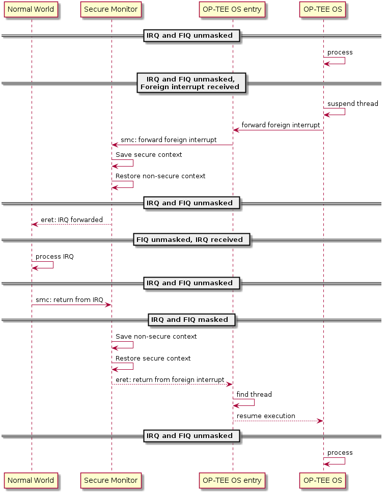

- [OP-TEE Documentation](https://optee.readthedocs.io/en/latest/architecture/index.html)

# Core
- Secure/Non-secure の切り替えは Secure monitor で行う
- Normal world から Secure world へ切り替えるには、SMC 命令を実行する
- SMC による動機例外は必ず Secure monitor でトラップされる
  - 必要に応じて Secure OS などに eret される
- 同様に、Secore world から Normal world へ戻るときにも SMC を使い、Secure monitor でトラップして Normall world に戻る

- Secure wolrd 用の割込みが入っ場合、Secore OS 側の割込みベクタで処理される
  - もしそのとき Normal world が実行されていたら、Secure monitor が割込みをトラップして Secure OS を起動する
- 同様に、normal world 用の割込みは normal world の割込みベクタで処理される
  - そのとき secure world が動いていたら、secure monitor が一時的に normal world に切り替えて割込みを処理する

## Core exception vectors
- secure monitor の割込みベクタは VBAR_EL3(vector base address register) によって指定される
- 今の CPU が Secure か Non-secure かは SCR(secure configuration register) レジスタの NS ビットにより判定できる
  - Secure monitor 実行中以外のときは、NS ビットは以下を表す
    - 0b0: PE is in Secure state.
    - 0b1: PE is in Non-secure state.

## Native and foreign interrupts
- OP-TEE から見て2種類の割込みがある
  - native interrupt: OP-TEE 自身が処理する割込み(S-EL1 向けの割込み)
  - foreign interrupt: それ以外の割込み (non-secure な割込みと、EL3 への割込み)
- GIC v2
  - native interrupt: FIQ
  - foreign interrupt: IRQ
- GIC v3
  - foreign interrupt: FIQ

## Normal world involokes OP-TEE OS using SMC
- secure monitor が normal world/secure world の切り替えを行う
- SMC には fast と yielding の2種類がある
  - fast smc: irq/fiq をマスクしたまま、entry 用のスタックを使って OP-TEE を実行する
  - yielding smc: そのうち irq/fiq のマスクを解除して実行する
    - 割込みを処理するために、OP-TEE は SMC 要求に対して trusted thread を割り当てる
    - trusted thread は、割込み発生時にコンテキストを保存する役割を持っている
  - どちらの smc も、終了するときには irq/fiq をマスクして entry スタックで実行される
  - 

## Deliver non-secure interrupts to normal world
- secure world で動作しているときに foregin interrupt がきたら、 secure world は
  1. trusted thread のコンテキストを保存する
  2. すべての割込みをマスクする
  3. etnry stack に戻る
  4. normal world に遷移することを表す値とともに smc を呼び出す
- smc が発行されて secure monitor にコードが戻ってきたら、secure world は normal world のコンテキストを復帰させる
- 割込み処理が終わったら、normal wolrd のプログラムは smc を呼び出して secure monitor 経由で tz に戻る
- 

## Deliver secure interrupts to secure world
- secure な割込みを処理する流れは、CPU が secure/non-secure の状態で異なる
- normal world 実行中に、secure な割込みを secure world に届ける場合
  - セキュアモニタが normal world のコンテキストを保存し、secure world のコンテキストを復帰させる
  - eret で OP-TEE に復帰する
  - OP-TEE が割込みを処理する
  - OP-TEE が SMC を実行して Secure monitor にスイッチ、normal world に戻る

## Trusted thread scheduling
- OP-TEE のサービスは SMC 命令で実行される
- OP-TEE が作る trusted thread は、completion ステータスとともに normal world に戻ると削除される
- trusted thread は通常どおり割込み(native interrupt)が発生すればそちらに時間を譲る
- 割込み(foreign interrupt)が発生すると normal world に遷移して割込みを処理することになる
- trusted thread は OP-TEE 経由で normal world が提供するサービスを叩くこともある
  - ファイルアクセスや REE current time など

- trusted thread が foreign interrupt で割り込まれて休止した場合、trusted thread は normal world から応答が返ってくるまで再開しない
- OP-TEE はスレッドのスケジューリング機能を持たない

- OP-TEE を呼び出す Linux のドライバは、呼び出した Linux 側のスレッドに対して1つの trusted thread を割り当てる
  - Linux 側のスレッドはもちろん Linux のスケジューラによって制御されるので、trusted thread も間接的に Linux のスケジューラによって制御される

- TEE では固定数の trusted thread を持つ(CFG_NUM_THREADS)
- SMP なシステムの場合は、Normal world の OS がプロセスのスケジューリングをサポートするのであれば、複数の trusted thread を同時に動かせる

## Core handlers for native interrupts
- 具体的な API の紹介などであり、省略

## Notifications
- notification = normal world にイベントを伝えるための仕組み
  - Synchronous: OPTEE_RPC_CMD_NOTIFICATION を使って実現
  - Asynchronous: non-secure な割込みと、そのハンドラで fast call することで実現

