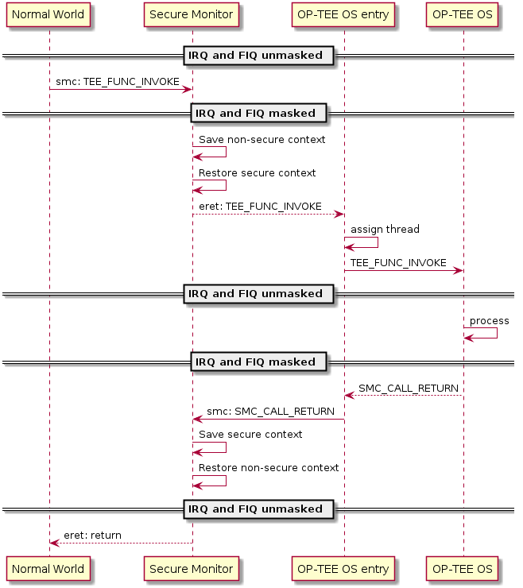

- [OP-TEE Documentation](https://optee.readthedocs.io/en/latest/architecture/index.html)

# Core
- Secure/Non-secure の切り替えは Secure monitor で行う
- Normal world から Secure world へ切り替えるには、SMC 命令を実行する
- SMC による動機例外は必ず Secure monitor でトラップされる
  - 必要に応じて Secure OS などに eret される
- 同様に、Secore world から Normal world へ戻るときにも SMC を使い、Secure monitor でトラップして Normall world に戻る

- Secure wolrd 用の割込みが入っ場合、Secore OS 側の割込みベクタで処理される
  - もしそのとき Normal world が実行されていたら、Secure monitor が割込みをトラップして Secure OS を起動する
- 同様に、normal world 用の割込みは normal world の割込みベクタで処理される
  - そのとき secure world が動いていたら、secure monitor が一時的に normal world に切り替えて割込みを処理する

## Core exception vectors
- secure monitor の割込みベクタは VBAR_EL3(vector base address register) によって指定される
- 今の CPU が Secure か Non-secure かは SCR(secure configuration register) レジスタの NS ビットにより判定できる
  - Secure monitor 実行中以外のときは、NS ビットは以下を表す
    - 0b0: PE is in Secure state.
    - 0b1: PE is in Non-secure state.

## Native and foreign interrupts
- OP-TEE から見て2種類の割込みがある
  - native interrupt: OP-TEE 自身が処理する割込み(S-EL1 向けの割込み)
  - foreign interrupt: それ以外の割込み (non-secure な割込みと、EL3 への割込み)
- GIC v2
  - native interrupt: FIQ
  - foreign interrupt: IRQ
- GIC v3
  - foreign interrupt: FIQ

## Normal world involokes OP-TEE OS using SMC
- secure monitor が normal world/secure world の切り替えを行う
- SMC には fast と yielding の2種類がある
  - fast smc: irq/fiq をマスクしたまま、entry 用のスタックを使って OP-TEE を実行する
  - yielding smc: そのうち irq/fiq のマスクを解除して実行する
    - 割込みを処理するために、OP-TEE は SMC 要求に対して trusted thread を割り当てる
    - trusted thread は、割込み発生時にコンテキストを保存する役割を持っている
  - どちらの smc も、終了するときには irq/fiq をマスクして entry スタックで実行される
  - 

## Deliver non-secure interrupts to normal world
